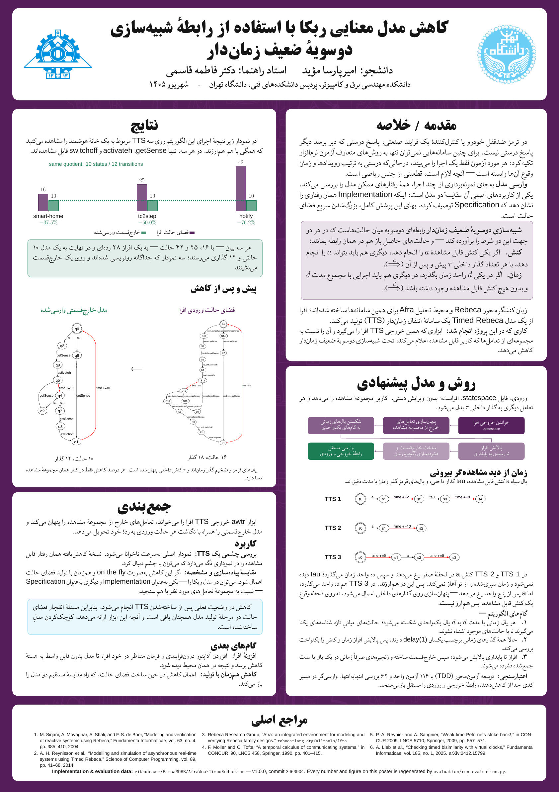

# my-poster

<div dir="rtl">

پوستر A1 پروژهٔ کارشناسی **«کاهش مدل معنایی ربکا با استفاده از رابطهٔ
شبیه‌سازی دوسویهٔ ضعیف زمان‌دار»**.

- دانشجو: امیرپارسا مؤید
- استاد راهنما: دکتر فاطمه قاسمی
- دانشکدهٔ مهندسی برق و کامپیوتر، پردیس دانشکده‌های فنی، دانشگاه تهران
- شهریور ۱۴۰۵

پوستر بر پایهٔ قالب [tehran-poster](https://github.com/ParsaMOBB/ut-poster)
ساخته شده است. کلاس قالب دست‌نخورده باقی مانده و افزوده‌های این پروژه در
`poster-extras.tex` جمع شده‌اند تا به‌روزرسانی قالب ساده بماند.

</div>

The poster presents **awtr**, a verified weak-timed-bisimilarity reducer for
Afra/RMC Timed Rebeca `.statespace` exports. The implementation and its
evaluation data live in
[AfraWeakTimedReduction](https://github.com/ParsaMOBB/AfraWeakTimedReduction).

<p align="center">
  
</p>

## Build

```bash
./build.sh          # -> build/main.pdf, and refreshes assets/poster-preview.png
```

Requires XeLaTeX and `latexmk`. All fonts are bundled under `fonts/`, so no
system font installation is needed. Every push also builds the poster in CI and
uploads the PDF as a workflow artifact.
